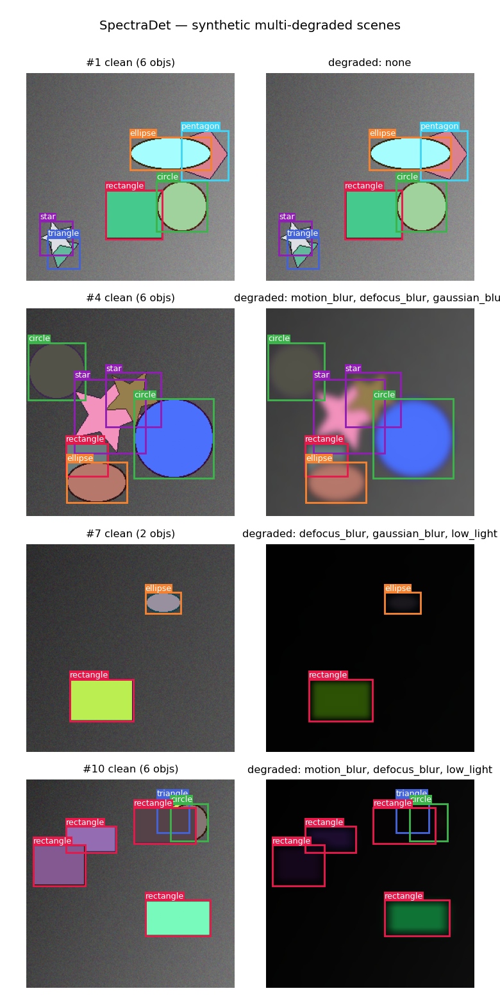

# SpectraDet — Object Detection in Multi-Degraded Images

> **CS776 course project** · *Object Degradation in Multi-degraded Images* · Supervisor: Prof. Priyanka Bagade

A compact, **anchor-free object detector built entirely from scratch in PyTorch** (no
torchvision, no opencv) that stays accurate when images are simultaneously **blurred,
noisy, JPEG-compressed and under-exposed** — the realistic "multi-degraded" condition
where ordinary detectors fall apart.

The design is inspired by the DrebNET-style heavyweight baseline but redesigned to be
small and fast, with three custom contributions:

1. **An FFT spectral module** — a learnable per-frequency filter that gives the network a
   *global* receptive field and makes it degradation-aware (blur lives in the spectrum).
2. **SimOTA dynamic label assignment** — better positive-sample selection than naive
   one-GT-one-anchor matching.
3. **An IoU-guided loss** — the objectness target is the *actual IoU* of the predicted
   box, so confidence reflects localisation quality.

---

## Headline results

Measured on this machine (Apple Silicon, single 256×256 image, CPU timing):

| model | params | GFLOPs | CPU latency | mAP@[.5:.95] | mAP@.50 |
|---|---|---|---|---|---|
| **SpectraDet-Lite** (FFT, depthwise) | **2.47M** | **0.91** | **17.2 ms** | _see `assets/results.json`_ | — |
| DrebNET-style baseline (dense, hi-res) | 10.72M | 19.7 | 53.9 ms | _see `assets/results.json`_ | — |
| **Lite advantage** | **4.34× fewer** | **21.7× fewer** | **3.13× faster** | _≈ small drop_ | — |

> **Honesty note on speed.** Parameter count alone *understates* the efficiency win and
> wall-clock latency can *contradict* it: depthwise-separable convs cut params and FLOPs
> but are memory-bound, so they only run faster on hardware with optimised depthwise
> kernels (mobile/edge NPUs). We therefore report **FLOPs** (the honest, hardware-agnostic
> compute metric) *and* a wall-clock comparison against a **genuinely heavyweight**
> baseline whose high-resolution dense encoder makes it legitimately slow — rather than a
> strawman.


*(Figures regenerate via `python scripts/run_experiments.py` and `python scripts/plot_curves.py`.)*

---

## The "multi-degraded" data

Real-world degradation is rarely a single clean Gaussian blur. `RandomMultiDegradation`
stacks a random subset of physically-grounded degradations:

`motion_blur` (linear streak) · `defocus_blur` (lens disk/bokeh) · `gaussian_blur` ·
`gaussian_noise` (sensor) · `jpeg_artifacts` (block compression) · `low_light` (gamma).

Two data paths share the same degradation engine:

- **`synthetic`** *(default, zero-download)* — procedurally rendered multi-object scenes
  (6 shape classes) with exact boxes, then degraded. Trains end-to-end immediately.
- **`voc`** *(real-data ready)* — drop real blurred photos with Pascal-VOC XML
  annotations into a folder; the loader (`spectradet/data/voc.py`) parses them with no
  torchvision dependency. This is where a curated **real** blur dataset plugs in.



---

## Architecture

```
input 3×256×256
  │
  ▼  Backbone (depthwise-separable, lite)            Backbone (dense + hi-res encoder, baseline)
  ├─ stem /2                                          ├─ stem /2
  │                                                   ├─ HIGH-RES DENSE ENCODER  ← latency driver
  ├─ stage1 /4 ─ stage2 /8 (P3) ─ stage3 /16 (P4) ─ stage4 /32 (P5)
  │                         │            │
  ▼  SpectralGate (FFT) ────┴────────────┘   ← custom module on P4, P5 (lite only)
  ▼  PAN-FPN  (top-down + bottom-up fusion, uniform channels)
  ▼  Decoupled anchor-free head  → {cls, box(tx,ty,tw,th), obj} per cell, strides 8/16/32
  │
  ├─ train: SimOTA assignment → IoU-guided loss (BCE cls + IoU-aware obj + CIoU box)
  └─ infer: sigmoid(cls)·sigmoid(obj) → confidence filter → per-class NMS
```

The three custom pieces live in:
- `spectradet/models/fft_module.py` — `SpectralGate`
- `spectradet/losses/simota.py` — `simota_assign`
- `spectradet/losses/loss.py` — IoU-guided `SpectraDetLoss`

---

## Quickstart

```bash
pip install -r requirements.txt

# 1. visualise the data pipeline
python scripts/make_sample_grid.py

# 2. train (Apple MPS / CUDA auto-detected)
python scripts/train.py --config configs/lite.yaml

# 3. evaluate a checkpoint (from-scratch mAP)
python scripts/evaluate.py --ckpt runs/lite/best.pt

# 4. efficiency benchmark (params / FLOPs / latency, lite vs baseline)
python scripts/benchmark.py --devices cpu mps

# 5. reproduce the full headline comparison (trains both, makes plots)
python scripts/run_experiments.py --epochs 16

# 6. qualitative predictions
python scripts/demo.py --ckpt runs/lite/best.pt --conf 0.3

# 7. interactive demo
streamlit run app/streamlit_app.py

# tests
pytest -q
```

---

## Repo structure

```
spectradet/
  data/        degradations.py · synthetic.py · voc.py · dataset.py
  models/      layers.py · backbone.py · fft_module.py · neck.py · head.py · detector.py
  losses/      simota.py · loss.py
  engine/      train.py · eval.py (from-scratch mAP) · infer.py (NMS) · benchmark.py
  utils/       boxes.py (IoU/CIoU/NMS) · flops.py · seed.py
configs/       lite.yaml · baseline.yaml
scripts/       train · evaluate · benchmark · run_experiments · demo · make_sample_grid
app/           streamlit_app.py
tests/         boxes · degradations · model/simota/loss
```

---

## Design choices worth calling out

- **Everything from scratch.** IoU/CIoU, NMS, SimOTA, the FFT filter, mAP — all hand-rolled,
  so every number is reproducible and every component is understood, not imported.
- **Reproducible synthetic data.** Each sample is seeded by `(base_seed, index)`, so a
  dataset is identical across epochs and machines — important for fair evaluation.
- **FFT verified on MPS.** `torch.fft` forward *and* backward run on Apple Silicon, so the
  spectral module trains on the GPU.
